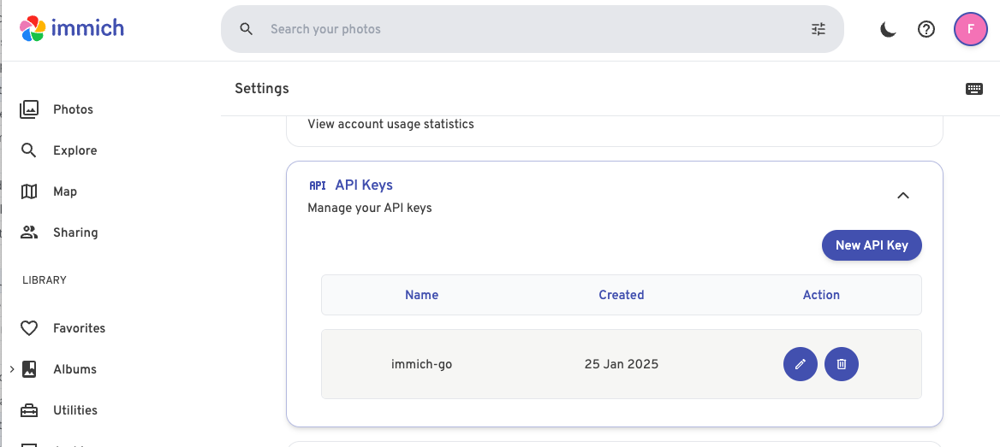
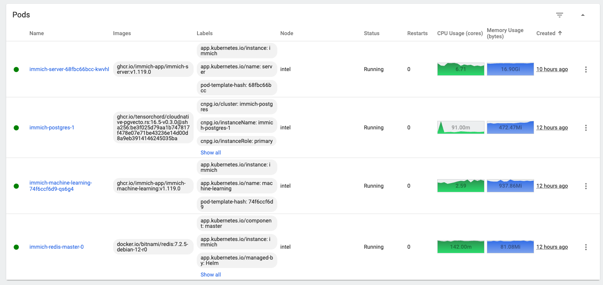

<!-- 2025-04-21-0315 (April 21, 2025 03:15:04 AM) -->

# Immich K3s

ref: [https://www.frankzhao.com.au/Kubernetes/Immich](https://www.frankzhao.com.au/Kubernetes/Immich)


- [Immich](https://immich.app/) K3s setup with CloudNativePG (for postgres instance), and community Immich helm charts.

---

## Pre-requisites

### Set up Postgres

When using the community Immich helm chart, the postgres subchart is deprecated, so we will need to set up our own postgres instances for Immich. In this example, I the install CloudnativePG operator to manage postgres clusters.

#### Set up CloudNativePG

```bash
helm repo add cnpg https://cloudnative-pg.github.io/charts
helm repo update
helm install cnpg \
  --namespace cnpg-system \
  --create-namespace \
  cnpg/cloudnative-pg
```

Create the immich namespace.

```bash
kubectl create namespace immich
```

Create postgres secret for initial postgres username/password

```yaml
apiVersion: v1
stringData:
  DB_USERNAME: immich
  DB_DATABASE_NAME: immich
  DB_PASSWORD: immich
  username: immich
  password: immich
kind: Secret
metadata:
  name: immich-postgres-user
  namespace: immich
type: kubernetes.io/basic-auth
```

Create postgres instance for immich using cnpg. Here I use `cloudnative-pgvecto.rs` and add initilization statements for the extensions required by Immich. 

> [!NOTE]
> Note that you may need to check which versions of pgvecto.rs are compatible with the Immich version being deployed.

```yaml
apiVersion: postgresql.cnpg.io/v1
kind: Cluster
metadata:
  name: immich-postgres
  namespace: immich
spec:
  imageName: ghcr.io/tensorchord/cloudnative-pgvecto.rs:16.5-v0.3.0@sha256:be3f025d79aa1b747817f478e07e71be43236e14d00d8a9eb3914146245035ba
  instances: 1
  postgresql:
    shared_preload_libraries:
      - "vectors.so"
  managed:
    roles:
      - name: immich
        superuser: true
        login: true
  bootstrap:
    initdb:
      database: immich
      owner: immich
      secret:
        name: immich-postgres-user
      postInitSQL:
        - CREATE EXTENSION IF NOT EXISTS "vectors";
        - CREATE EXTENSION IF NOT EXISTS "cube" CASCADE;
        - CREATE EXTENSION IF NOT EXISTS "earthdistance" CASCADE;
 
  storage:
    size: 4Gi
    storageClass: local-path
```

### Set up Volumes

Create PVs and PVCs for immich library and immich ML cache.

- adjust the storage size/capacity to desired GB

> [!NOTE]
> Might not required to create PVs as it is automatically provisioned by `local-path-provisioner` (k3s' default storage class)

```yaml
---
apiVersion: v1
kind: PersistentVolume
metadata:
  name: immich-ml-pv
  labels:
    type: local
spec:
  storageClassName: manual
  capacity:
    storage: 10Gi
  accessModes:
    - ReadWriteOnce
  hostPath:
    path: "/var/k8-volumes/immich-ml"
---
apiVersion: v1
kind: PersistentVolume
metadata:
  name: immich-library-pv
  labels:
    type: local
spec:
  storageClassName: manual
  capacity:
    storage: 350Gi
  accessModes:
    - ReadWriteOnce
  hostPath:
    path: "/usr/share/synology/immich"
---
apiVersion: v1
kind: PersistentVolumeClaim
metadata:
  name: immich-ml-pvc
spec:
  storageClassName: manual
  accessModes:
    - ReadWriteOnce
  resources:
    requests:
      storage: 10Gi
---
apiVersion: v1
kind: PersistentVolumeClaim
metadata:
  name: immich-library-pvc
spec:
  storageClassName: manual
  accessModes:
    - ReadWriteOnce
  resources:
    requests:
      storage: 250Gi
```

If using NFS volume, this can be mounted on the local filesystem:

```bash
$ sudo mkdir -p /usr/share/synology/immich
 
$ cat ~/.smbcreds
username=changeme
password=changeme
 
$ sudo mount -t cifs -o credentials=/home/frank/.smbcreds //thunderbolt.juju.net/shared/immich /usr/share/synology/immich
```

---

## Install Immich

We use the [community helm chart](https://github.com/immich-app/immich-charts/tree/main).

Create `values.yaml` file for immich, reference the created PVCs. If you are using [Ingress certificates with private CA](https://www.frankzhao.com.au/Kubernetes/Ingress-certificates-with-private-CA), you can also add the `cert-manager` annotations on `server.ingress.annotations`.

```yaml
env:
  REDIS_HOSTNAME: '{{ printf "%s-redis-master" .Release.Name }}'
  DB_HOSTNAME: "{{ .Release.Name }}-postgres-rw.immich.svc.cluster.local"
  DB_USERNAME: "{{ .Values.postgresql.global.postgresql.auth.username }}"
  DB_DATABASE_NAME: "{{ .Values.postgresql.global.postgresql.auth.database }}"
  DB_PASSWORD: "{{ .Values.postgresql.global.postgresql.auth.password }}"
  IMMICH_MACHINE_LEARNING_URL: '{{ printf "http://%s-machine-learning:3003" .Release.Name }}'
 
image:
  tag: v1.124.2
 
immich:
  metrics:
    enabled: false
  persistence:
    library:
      existingClaim: immich-library-pvc
  configuration: {}
  
# Dependencies
redis:
  enabled: true
  architecture: standalone
  auth:
    enabled: false
 
# Immich components
server:
  enabled: true
  image:
    repository: ghcr.io/immich-app/immich-server
    pullPolicy: IfNotPresent
  ingress:
    main:
      enabled: true
      annotations:
        traefik.ingress.kubernetes.io/router.entrypoints: websecure
        traefik.ingress.kubernetes.io/service.serversscheme: https
        traefik.ingress.kubernetes.io/service.nativelb: "true"
	    traefik.ingress.kubernetes.io/service.sticky.cookie: "true"
      hosts:
        - host: immich.kube
          paths:
            - path: "/"
      tls: []
 
machine-learning:
  enabled: true
  image:
    repository: ghcr.io/immich-app/immich-machine-learning
    pullPolicy: IfNotPresent
  env:
    TRANSFORMERS_CACHE: /cache
  persistence:
    cache:
      enabled: true
      size: 10Gi
      existingClaim: immich-ml-pvc
```

Install the helm chart

```bash
helm repo add immich https://immich-app.github.io/immich-charts
helm repo update
helm install --create-namespace --namespace immich immich immich/immich -f values.yaml
```

If using external libraries, edit the immich-server deployment to add any additional mounts for external libraries. Note: external libraries must be outside the `/usr/src/app` path.

```bash

$ kubectl -n immich get deployment immich-server -o yaml
...
volumeMounts:
- mountPath: /usr/src/app/upload
  name: library
- mountPath: /usr/src/external/synology
  name: library
```

If using Traefik, we need to enable sticky sessions on the service for websockets to work nicely.

```bash
$ kubectl -n immich get service immich-server -o yaml 
apiVersion: v1
kind: Service
metadata:
  annotations:
    ...
    traefik.ingress.kubernetes.io/service.nativelb: "true"
    traefik.ingress.kubernetes.io/service.sticky.cookie: "true"
```

---

## Importing

For batch importing of images from Google Takeout or iCloud data export, you can use [immich-go](https://github.com/simulot/immich-go).

This will import assets into the Immich library itself, rather than linking to an external library. There are several benefits with this:

- You can manage all the original files with Immich.
- Have server stats reporting (External libraries are not reflected in server stats.)
- Consolidate Google Photos metadata, since these are exported as sidecar JSON files from Google Takeout.

### Example of importing with immich-go

First configure an API key in Immich using `Account Settings > API Keys`.

 

Google Takeout

```bash
./immich-go -server=https://immich.kube -key=$(cat /Users/frank/dev/immich-key) -skip-verify-ssl upload -google-photos /Volumes/shared/immich/google-photos
```

iCloud

```bash
./immich-go -server=https://immich.kube.juju.net -key=$(cat /Users/frank/dev/immich-key) -skip-verify-ssl upload /Volumes/shared/immich/icloud-photos
```

Resource usage profile during external library scanning. 

 

